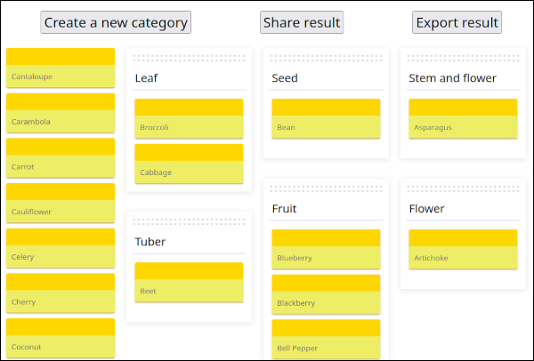
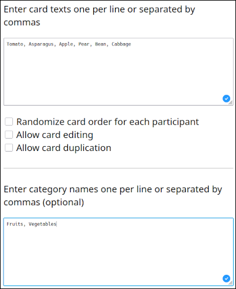
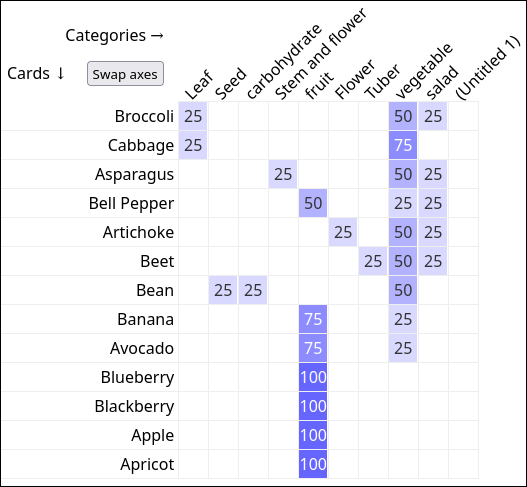

# Card Sort +

Card Sort + is a **free and open-source** tool for conducting virtual card sorting. It was built as a way to **quickly conduct card sorting online**, without the need to sign up or subscribe to commercial solutions or self-host an open-source project.

It is most effective when used in conjunction with other tools. For example, you could create a form with instructions, a questionnaire and a link to card sorting. You could also ask the participants to copy the results back into the form.

[](./images/sort.png)

Card Sort Allows to:

- Quickly create card to sort from a simple comma separated list of items
- Quickly preset some categories (comma-separated list of categories)  
[](./images/set_cards_cats.png)
- Choose if cards are randomized or not
- Choose if users can create new cards or new categories
- Create a link to share card testing with others. e.g.: [Link example](https://bmarne.codeberg.page/cardsortplus/card-sort.html#eJw9kcFOwzAMhl8FlesuXHdBUGAHNq1ikxBCHNzgtdaSOHITpgnx7iTOOlXK_9lyftvpb3PbLD-bhxAsNousQoZjIYlkRj5qdgogMKSp8A8b-OZMj-DzVwDBq2BUsfamwxBQSmTBHHsUOWuQ8MrCxrCljC30PQyo5CNYTqEGAq5nC5VFx2ohWTpYPql7ixbVrR0vti0b9kkrWcpUrYCfe7bJJNfrzSeIpcfzMASbm2Z8oSGfKxBLpgDzdB12JRDwIIniHGR9pRPNuTXiUcWxV40xmVK0JldkA34ob7ZJ0yjMLuPWk9Zu84C6fAcBzqAgk6dQCMGMVaVKOckjXP5XZ1Px6tjhkH3qUh1HiKVbl1w4UmnyBt80jQpTmLfaBfLVfxcFTnN6z65e3yepY7xnX3Fodd4PcM3Xorlvlnd__zI6t8U=)
- Share sorting results as a link to show the results in Card Sort or to export results as a JSON (in the clipboard) e.g. [example of link to share a card table](https://bmarne.codeberg.page/cardsortplus/card-sort.html#eJxFUcFuwjAM_RXUXbnsymWCbnAYiGogTdO0gxtMG5HEkZsMoWn_vtgFpkp5z4n9_Oz-VGuEYzX7rBZMxpCz1bSqoW2hw-prWu0QD_qKEDRO6CcQDpOjozOyPM2HCAxdHuR9ydkmLXAZW2S-FL2FA3O6B-jcpMEYS3WJIJSvkPk3GTiQsBgdKrI1lFT1vxkna3o6qbl9bsfbBaLmPUhQQ0jgKEfUURh8Sw5GzkVPSHb2OkCJ0KE6q_urxZoMhayZxEGAIdz819lk32rlMyTp8dJ10ZWmhS5tV84VsLNGCNFw38KKIeJR93MNCr7as73drRFPCp6CYkrZSNLaeoENhE4WtMlDz0S-0G2wmrstBjvJaSDCBZTwEGwUhmD6EXkEOW1AuC66cVm0GvLYFZ1xqIYSJOnWZB9PVpq8wcEOvZIh3qbaRRtG_V1iON-u9-TH8n3m0cZ70WWPTv1-gJf_9VTNHn__AI5qzhg=).
- Have an overview of the results in a basic but efficient enough visual interface showing them  


Card Sort + is a (friendly) soft fork of [Card Sort](https://github.com/indigane/cardsort). It was created to [implement some missing features](https://github.com/indigane/cardsort/pull/6). The new features are:

- Allows adding local images with a relative or an absolute file path (Card Sort only allows adding online images with an HTTP path, and embedded images with a data path).
- Enables users to edit card content (then, the old content is shown as struck through).
- Enables users to duplicate the cards (then they can sort the cards into several categories).
- Adds an export button to export refined data provided in the analysis tool to a CSV (copied to the clipboard)
- Adds a share button to generate a shareable URL with the current state of the analysis (copied to the clipboard). Ex.: [Shared Analysis URL](https://bmarne.codeberg.page/cardsortplus/analysis.html#eJxVkDFuwzAMRa9icNYJutUBOnUI2qBL4YGSflwjsmXQcovC0N0jKnDSQoNI8X3yUxsdWPxCT58bvcg6JA3pCBYydIojp1iC53kOoM7QB3oktgEVO7C13KMALXhSbplZuF8X6rLZ6BV8Vq6V6FwMQyF2Sen1DvhaVa3mCWPDk2_OIf5AtPSnn7nZq4KwwkLkVwcHdpd7ghCaI-YZ6r7lqRx19R0d-8ceesvgYqpdH8MkDe4rXqq502pvry1QuNyp9YQ-yqC7b7ub_dOyoTdMPML_w3K-At4Vc9Y=).

## Demo


[Test me](https://bmarne.codeberg.page/cardsortplus/card-sort.html#eJw9kcFOwzAMhl8FlesuXHdBUGAHNq1ikxBCHNzgtdaSOHITpgnx7iTOOlXK_9lyftvpb3PbLD-bhxAsNousQoZjIYlkRj5qdgogMKSp8A8b-OZMj-DzVwDBq2BUsfamwxBQSmTBHHsUOWuQ8MrCxrCljC30PQyo5CNYTqEGAq5nC5VFx2ohWTpYPql7ixbVrR0vti0b9kkrWcpUrYCfe7bJJNfrzSeIpcfzMASbm2Z8oSGfKxBLpgDzdB12JRDwIIniHGR9pRPNuTXiUcWxV40xmVK0JldkA34ob7ZJ0yjMLuPWk9Zu84C6fAcBzqAgk6dQCMGMVaVKOckjXP5XZ1Px6tjhkH3qUh1HiKVbl1w4UmnyBt80jQpTmLfaBfLVfxcFTnN6z65e3yepY7xnX3Fodd4PcM3Xorlvlnd__zI6t8U=), then paste the *Exported Results* to [the analysis tool](https://bmarne.codeberg.page/cardsortplus/analysis.html) (you can paste more than one result, they are added to the analysis). 

-----

Analysis tools are in development. If you’re interested, you can take a look at the [current progress](https://indigane.github.io/cardsort/analysis.html) and discuss [in the issues page](https://github.com/indigane/cardsort/issues/2).


## Create your own


<https://bmarne.codeberg.page/cardsortplus/>


## Read about card sorting

<https://en.wikipedia.org/wiki/Card_sorting>


-----

## Advanced use

### Insert images

Images can be added to the cards by typing `image:` and a link to the image.

```
image:https://domain.tld/image.jpg
```

or

```
image:../myfolder/image.jpg
```

Text can also be included before or after an image.

```
image:https://domain.tld/cat.jpg A photo of a cat
```

### Programmatic use

Query parameters can be passed to the card sorting page instead of going through the creation form.

All parameters are optional.

```url
https://bmarne.codeberg.page/cardsortplus/card-sort.html?cards=a,b,c&categories=1,2,3&allowCategoryEditing=0&isRandomized=1
```
